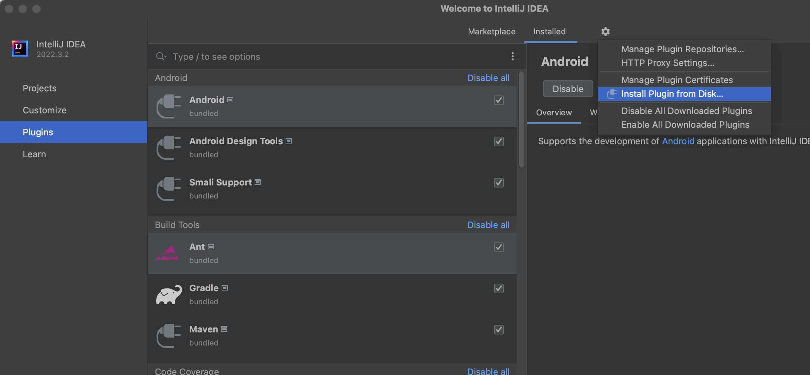
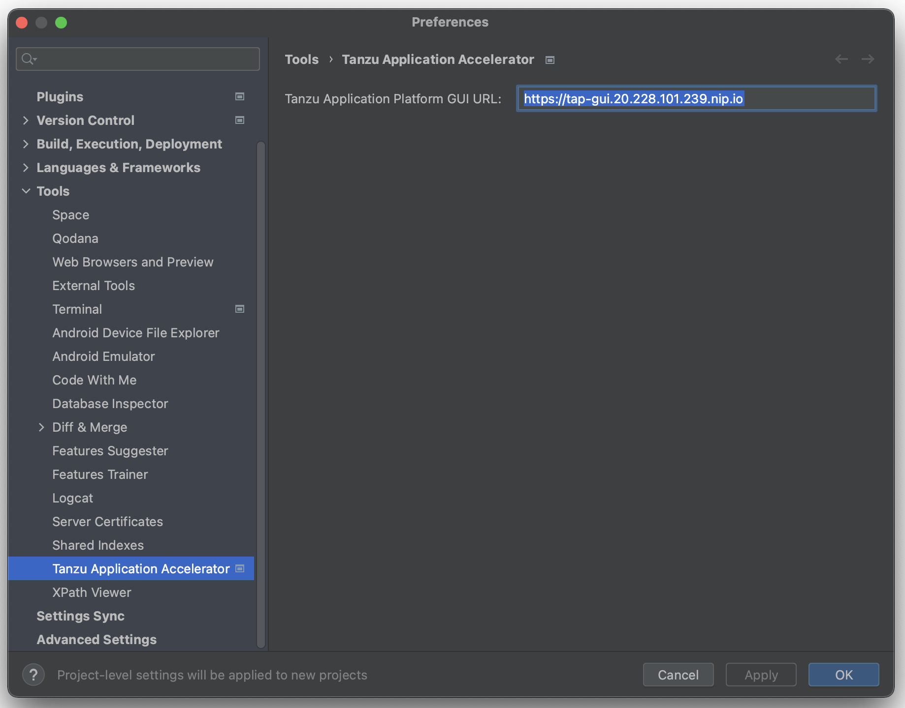
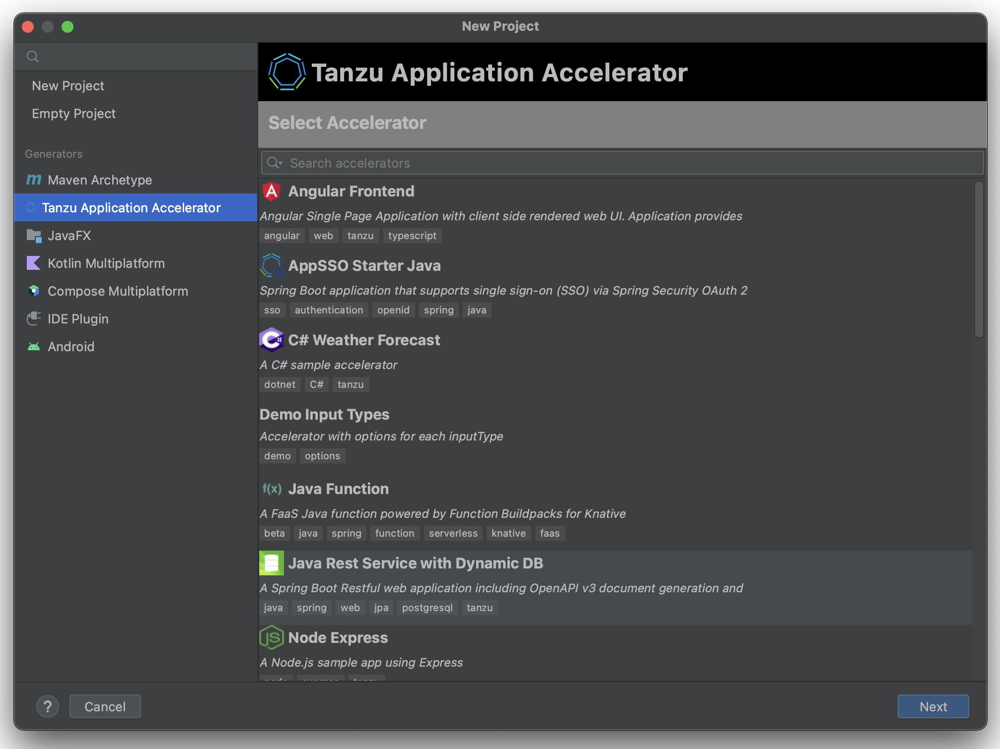
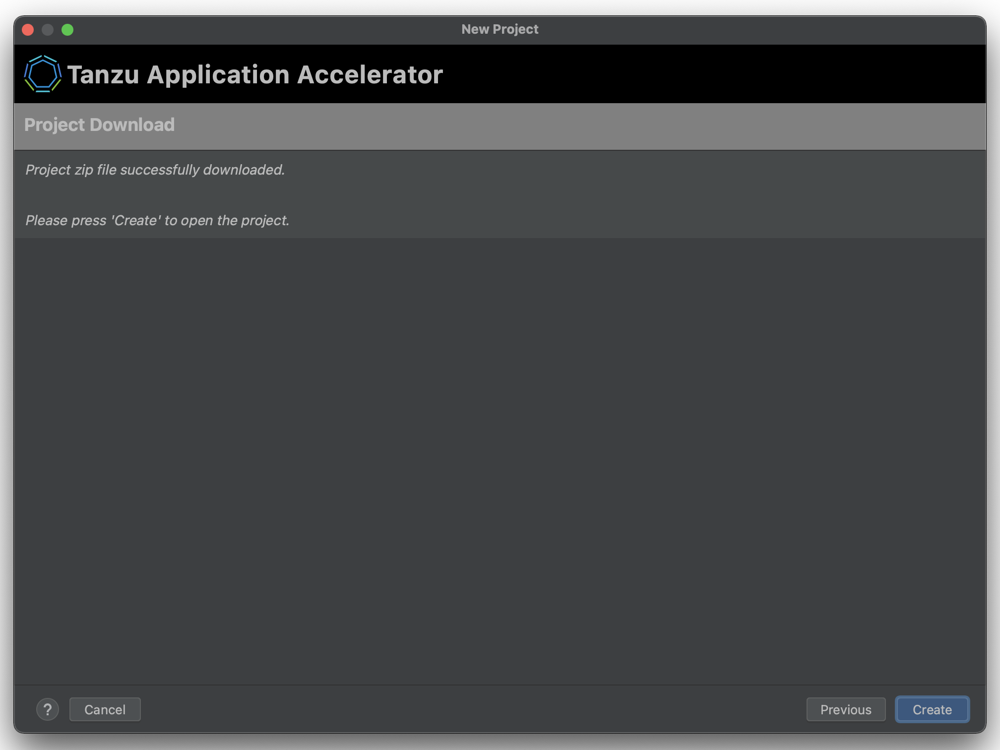

# Application Accelerator IntelliJ Plugin

The Application Accelerator IntelliJ plugin lets you explore and generate projects
from the defined accelerators in Tanzu Application Platform using IntelliJ.

## <a id="dependencies"></a> Dependencies

- To use the plugin, the plugin must access the Tanzu Application Platform GUI URL.
For information about how to retrieve the Tanzu Application Platform GUI URL, see
[Retrieving the URL for the Tanzu Application Platform GUI](#fqdn-tap-gui-url).

## <a id="intellij-app-accel-install"></a> Installation

Use the following steps to install the Application Accelerator IntelliJ plugin:

1. Sign in to VMware Tanzu Network and download the "Tanzu App Accelerator Extension for Intellij" zip file from the product page for [VMware Tanzu Application
   Platform](https://network.tanzu.vmware.com/products/tanzu-application-platform).

2. Open IntelliJ

    1. Go to `Plugins` section on the left.

    2. Select the Gear button on the top right and select `Install Plugin from Disk...`

        

    3. Select the plugin zip file.

    4. Restart IntelliJ
   
## <a id="intellij-configure-the-plugin"></a> Configure the plugin

Before using the plugin, you need to enter the Tanzu Application Platform GUI URL in the IntelliJ Preferences:

1. Go to the IntelliJ menu **IntelliJ IDEA > Preferences**.

2. Under `Tools` on the left side, select `Tanzu Application Accelerator`.

3. On the right side, add the `Tanzu Application Platform GUI` URL.

   

    An example URL: `https://tap-gui.myclusterdomain.myorg.com`. If you have access to the Tanzu
    Application Platform cluster that is running the Tanzu Application Platform GUI, you can run the
    following command to determine the fully-qualified domain name:

    ```console
    kubectl get httpproxy tap-gui -n tap-gui
    ```
4. Click `Apply` and `OK`.

## <a id="intellij-using-the-plugin"></a> Using the plugin

After adding the `Tanzu Application Platorm GUI URL` you can explore the defined accelerators
by selecting `New Project`.


Then select `Tanzu Application Accelerator` on the left side.



Choose any of the defined accelerators, fill the options on the next page.


Click `Next` to review the options.


Click `Next` again to download the project. If the project is downloaded successfully, the `Create` button is enabled and you can now create and open the project.



## <a id="fqdn-tap-gui-url"></a> Retrieving the URL for the Tanzu Application Platform GUI

If you have access to the Tanzu Application Platform cluster that is running the Tanzu Application
Platform GUI, you can run the following command to determine the fully-qualified domain name:

```console
kubectl get httpproxy tap-gui -n tap-gui
```

With an expected response of something similar to:

```console
NAME      FQDN                                      TLS SECRET     STATUS   STATUS DESCRIPTION
tap-gui   tap-gui.tap.tapdemo.myorg.com             tap-gui-cert   valid    Valid HTTPProxy
```

## <a id="download-install-self-signed-certs">Download and Install Self-Signed Certificates from the Tanzu Application Platform GUI
For the Application Accelerator plugin to communicate with a Tanzu Application Platform GUI instance that is secured using TLS, downloading and installing the certificates locally is required.

1. Find the name of the Tanzu Application Platform GUI certificate. Note that the name of the certificate may look different.
    ```console
    $ kubectl get secret -n cert-manager
    ```

    ```console
    NAME                                           TYPE                             DATA   AGE
    canonical-registry-secret                      kubernetes.io/dockerconfigjson   1      18d
    cert-manager-webhook-ca                        Opaque                           3      18d
    postgres-operator-ca-certificate               kubernetes.io/tls                3      18d
    tanzu-sql-with-mysql-operator-ca-certificate   kubernetes.io/tls                3      18d
    tap-ingress-selfsigned-root-ca                 kubernetes.io/tls                3      18d <------- This is the certificate that is needed
    ```
2. Download the certificate by running the following command.
    >**Note** The following script depends on [`yq`](https://github.com/mikefarah/yq) to process the YAML output.

    ```console
    $ kubectl get secret -n cert-manager tap-ingress-selfsigned-root-ca -o yaml | yq '.data."ca.crt"' | base64 -d > ca.crt
    ```

3. Install the certificate on your local system
    * Installing the certificate on Mac
    ```console
    $ sudo security add-trusted-cert -d -r trustRoot -k /Library/Keychains/System.keychain ca.crt
    ```
    * [Link on how to install certificates on Ubuntu](https://ubuntu.com/server/docs/security-trust-store)
    * Installing the certificate on Windows
        1. Using Windows Explorer, navigate to the directory where the certificate was downloaded and double click on the certificate.
        2. In the Certificate window, click "Install Certificate...".
        3. Change the "Store Location" from "Current User" to "Local Machine". Click Next.
        4. Select "Place all certificates in the following store", click "Browse", and select "Trusted Root Certification Authorities"
        5. Click Finish.
        6. If successfully imported, a popup window stating "The import was successful." will appear.

4. Fully restart any applications that will be leveraging the certificate.
5. Once restarted, the application will be able to leverage the newly installed certificate to communicate with the endpoints using TLS.
